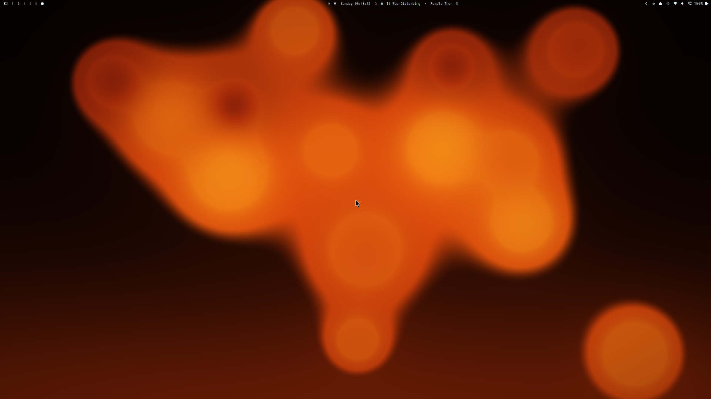

# Lava Lamp for Omarchy

A live lava lamp wallpaper with **real convection physics** — not a video
loop. Wax blobs are simulated on the CPU (buoyancy, viscosity, heat
exchange, surface tension) and rendered as fluid GPU metaballs. The wax
merges, tears and breathes; your cursor is a warm finger that stirs it; a
control panel tunes everything live.



## Features

- **Real physics** — per-blob temperature drives buoyancy: the bottom
  heats, the top cools, blobs rise and sink like actual wax. Viscous drag,
  soft-sphere repulsion, damped walls.
- **Liquid dynamics** — slow-moving blobs in contact lose their repulsion
  and **coalesce** (volume, momentum and heat conserved — you see the wax
  flow together); large fast blobs **pinch off** in two. The blob count
  breathes around your target.
- **Pointer play** — the cursor displaces and warms the wax (warmed blobs
  rise on their own); a click taps the glass.
- **Live control panel** — every knob on a floating card: blob count,
  size, spread, speed, heat, touch strength, liquid tuning, colors, and a
  "Reset to defaults". Changes apply on the drag itself and persist on
  release (`~/.config/lavalamp/config.json`).
- **Liquid moods** — five physics presets (Classic lava, Syrup, Mercury,
  Zero-G, Eruption) plus a Shuffle button that rolls tasteful random
  physics.
- **Color presets** — 13 palettes derived from stock Omarchy themes
  (Hackerman, Tokyo Night, Catppuccin, Nord, Kanagawa, Everforest...),
  with independent top/bottom background hue and a live Omarchy accent
  re-tint.
- **Eco mode** — the simulation pauses when a fullscreen window covers
  every screen and ticks at 10 Hz on battery.

## Install

```
omarchy plugin add https://github.com/Realrandombacon/lavalamp --enable
```

The flame icon appears in the bar's right section (click it to open the
panel). Optionally add a keybinding in `~/.config/hypr/bindings.lua`:

```lua
o.bind("SUPER + ALT + L", "Lava lamp panel",
       "omarchy-shell shell toggle io.github.realrandombacon.lavalamp")
```

Headless control (partial patches merge onto the current config):

```
omarchy-shell lavalamp set '{"hue":0.45}'
omarchy-shell lavalamp reset
```

To remove: `omarchy plugin remove io.github.realrandombacon.lavalamp`, then
re-enable the stock background (`omarchy.background`) in
`~/.config/omarchy/shell.json` and restart the shell.

## How it works

Hybrid CPU/GPU, built for battery life:

- `Physics.js` — pure ES5 simulation (runs in QML and headless under
  node). Normalized [0,1]² domain, y down, aspect-corrected. Convection,
  surface tension, coalescence (r³ volume conservation), asymmetric
  pinching, anti-oscillation cooldowns, deterministic seeded spawn.
- `lavalamp.frag` — GLSL metaball shader (Σ rᵢ²/dᵢ² field), compiled to
  `.qsb` with `qsb --glsl "100 es,120"` — a 440 fragment variant fails to
  link against Qt's built-in vertex shader.
- `Background.qml` — layer-shell service, one shared simulation stepped
  by a 33 ms Timer per root (not per screen), 32 individual vec4 uniforms
  (std140 vec4 arrays do not bind through ShaderEffect).
- `Panel.qml` — control panel (scrolls on small screens).
- `BarWidget.qml` — bar flame icon, toggles the panel.

## Development

```
./deploy.sh              # compile shaders + copy to the live plugin dir + rescan
./deploy.sh --restart    # + omarchy restart shell
```

⚠️ After editing `lavalamp.frag`, hot-reload is not enough — the shell
keeps serving the old `.qsb`; pass `--restart`.

Headless physics test (5 minutes of lamp time per liquid mood, asserting
no-NaN, bounds, volume conservation, breathing, pointer behavior):

```
node tests/test-physics.js
```

## License

[MIT](LICENSE)